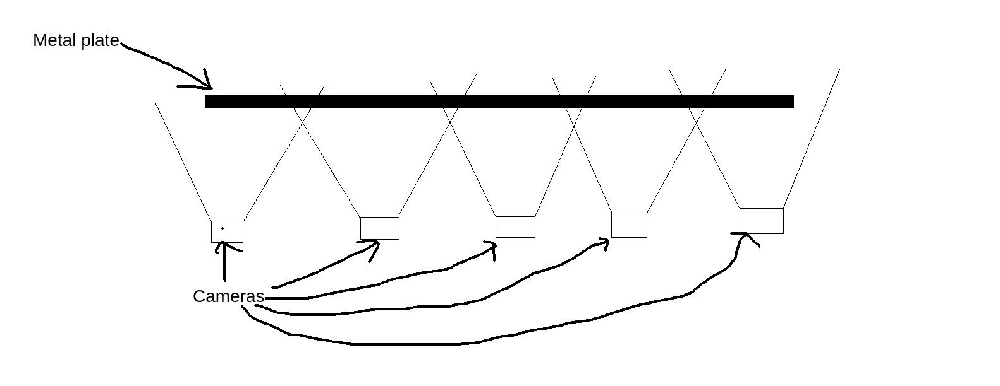
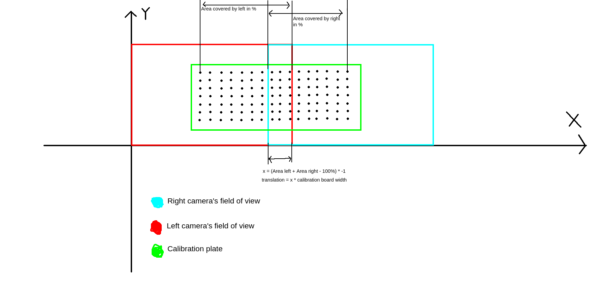

# Multiple camera calibration

Code for calibrating setup of multiple cameras written in Python and OpenCV

---

# Table of contents

1. [Requirements](#requirements)
2. [Explanation of setup](#explanation)
3. [How to use](#how-to-use)
5. [How it works](#how-it-works)


---

# Requirements <a name="requirements"></a>

- Python 3 (Written in Python 3.10)

- OpenCV
```
pip3 install opencv-python
```

- Numpy
```
pip3 install numpy
```

---

# Explanation of setup <a name="explanation"></a>

Setup looks something like this:


To calibrate use an calibration plate that is big enough to be visible on two cameras at once.

Try ensure that calibration plate is somewhat horizontal to the ground (If it is rotated more than 45 degress there is a change that program won't work)

Make sure that cameras next to each other doesn't have dead space between them. Their field of view should always intersect (About 5%).

While calibrating make sure that calibration plate is visible only on two cameras (It's beggining must be visible on left camera and it's ending must be visible on right camera). If this condition is not fulfilled program won't work.

---

# How to use <a name="how-to-use"></a>

TODO

## How it works <a name="how-it-works"></a>

### List of steps:
##### 1. Get set of corresponding images (left camera image and right camera image of the same calibration plate)

##### 2. Calibrate each camera separately (remove distortions)
This step is essential to ensure accurare calculations in later phases.

##### 3. Detect blobs
In this step program detects every blob on each image and saves it to unorganised array

##### 3. Create grid
Organise detected blobs in a way that makes them into grid. 2D array is created for each image. First axis has rows and second axis has columns.

##### 4. Calculate rotation
Calculate average line crossing each row and calculate it's angle of inclination.

##### 5. Rotate image and keypoints, so they are horizontal to X-axis.

##### 6. Calculate average distance between neighbouring blobs

##### 7. Calculate how much width of calibration plate is covered in each image
It's done using known dimentions of calibration grid and calcualted before distance between blobs

##### 8. Calculate translation between cameras
If fields of view of cameras are intersecting translation will be negative

Image explaining how translation is calcualated (after images are rotated to ensure parallel position with X-axis):




